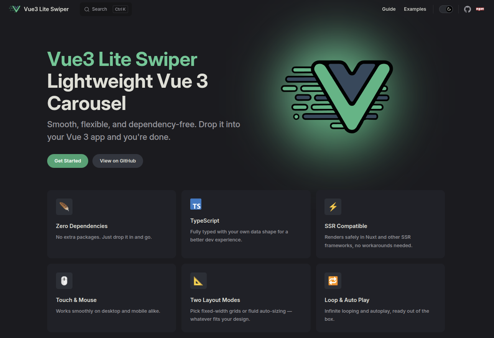

# Vue3 Lite Swiper

**Vue3 Lite Swiper** is a lightweight Vue 3 carousel component with zero runtime dependencies. It handles touch and mouse drag, snap positioning, infinite looping, and autoplay — all without a single external package.

📖 **[Read the full documentation →](https://vue3-lite-swiper.vuedoo.org)**

## Why Vue3 Lite Swiper?

Most carousel libraries ship with their own animation engine, event system, and DOM abstractions. Vue3 Lite Swiper keeps things simple:

- **Lightweight** — No runtime dependencies, small bundle footprint
- **SSR Compatible** — Safe to use in Nuxt and other SSR frameworks out of the box
- **Looping** — Smooth infinite looping without visual jumps or layout shifts
- **TypeScript** — Fully typed slot props with your own data shape
- **Touch & Mouse** — Native drag support works seamlessly on desktop and mobile
- **Two Layout Modes** — Fixed-width grids or fluid auto-sizing to fit any design

## Installation

Install the package using your preferred package manager.

```sh
# bun
bun add vue3-lite-swiper

# npm
npm install vue3-lite-swiper

# pnpm
pnpm add vue3-lite-swiper

# yarn
yarn add vue3-lite-swiper
```

## Basic Example

A minimal setup using fixed-width slides with previous and next navigation controls.

```vue
<script setup lang="ts">
import { useTemplateRef } from "vue";
import { Swiper } from "vue3-lite-swiper";

const swiper = useTemplateRef("swiper");

const slides = [
  { label: "Slide 1", color: "#60a5fa" },
  { label: "Slide 2", color: "#34d399" },
  { label: "Slide 3", color: "#a78bfa" },
  { label: "Slide 4", color: "#f87171" },
  { label: "Slide 5", color: "#fbbf24" },
  { label: "Slide 6", color: "#e879f9" },
  { label: "Slide 7", color: "#2dd4bf" },
  { label: "Slide 8", color: "#fb923c" },
];
</script>

<template>
  <div class="demo">
    <Swiper
      ref="swiper"
      mode="fixed"
      :slides="slides"
      :slide-width="220"
      :gap="16"
    >
      <template #default="{ item }">
        <div class="slide" :style="{ background: item.color }">
          <span>{{ item.label }}</span>
        </div>
      </template>
    </Swiper>

    <div class="controls">
      <button class="btn" @click="swiper?.previous()">← Prev</button>
      <div class="dots">
        <button
          v-for="(_, i) in swiper?.total"
          class="dot"
          :key="i"
          :class="{ active: swiper?.current === i }"
          @click="swiper?.goToIndex(i)"
        />
      </div>
      <button class="btn" @click="swiper?.next()">Next →</button>
    </div>
  </div>
</template>

<style scoped>
.demo {
  border: 1px solid var(--vp-c-divider);
  border-radius: 12px;
  padding: 24px;
  background: var(--vp-c-bg-soft);
}

.slide {
  width: 220px;
  height: 140px;
  border-radius: 10px;
  display: flex;
  align-items: center;
  justify-content: center;
  font-size: 1rem;
  font-weight: 700;
  color: #fff;
  text-shadow: 0 1px 3px rgba(0, 0, 0, 0.25);
  user-select: none;
}

.controls {
  display: flex;
  align-items: center;
  justify-content: space-between;
  margin-top: 16px;
}

.btn {
  padding: 6px 16px;
  border-radius: 6px;
  border: 1px solid var(--vp-c-divider);
  background: var(--vp-c-bg);
  color: var(--vp-c-text-1);
  cursor: pointer;
  font-size: 0.875rem;
  transition: background 0.15s;
}

.btn:hover {
  background: var(--vp-c-brand-soft);
}

.dots {
  display: flex;
  gap: 8px;
}

.dot {
  width: 8px;
  height: 8px;
  border-radius: 50%;
  border: none;
  background: var(--vp-c-divider);
  cursor: pointer;
  padding: 0;
  transition: background 0.2s;
}

.dot.active {
  background: var(--vp-c-brand-1);
}

.flex {
  display: flex;
}
</style>
```

## Props

The `<Swiper>` component is generic — the type parameter `T` is inferred from the `:slides` prop, giving you fully typed slot props with no casting.

| Prop               | Type                | Default   | Description                                                                         |
| ------------------ | ------------------- | --------- | ----------------------------------------------------------------------------------- |
| `slides`           | `T[]`               | —         | **Required.** The data array. Each element is passed as `item` in the default slot. |
| `mode`             | `"fixed" \| "auto"` | `"fixed"` | How slide widths and snap positions are resolved (see below).                       |
| `slideWidth`       | `number`            | —         | Slide width in pixels. **Required when `mode="fixed"`.**                            |
| `gap`              | `number`            | `20`      | Horizontal gap between slides, in pixels.                                           |
| `slidesPerSwipe`   | `number`            | `1`       | Slides to advance per navigation step.                                              |
| `loop`             | `boolean`           | `false`   | Enable seamless infinite looping.                                                   |
| `autoPlay`         | `boolean`           | `false`   | Advance automatically at a fixed interval.                                          |
| `autoPlayInterval` | `number`            | `3000`    | Milliseconds between autoplay advances.                                             |
| `pauseOnHover`     | `boolean`           | `true`    | Pause autoplay while the pointer is over the swiper.                                |

### `mode`

The `mode` prop controls how the swiper figures out each slide's width and where the snap positions land.

- **`"fixed"`** — You provide `slideWidth`. Snap positions are computed mathematically without measuring the DOM. This is the fastest option and the right choice whenever every slide is the same width. Omitting `slideWidth` in this mode logs an error and disables all snap navigation.
- **`"auto"`** — The component measures each slide's rendered width via `getBoundingClientRect()` after mount. Use this when slide widths differ or are driven by CSS rather than a fixed pixel value.

## Slots

### `default`

Renders a single slide. It receives the typed slide data and that item's original index.

```vue
<Swiper :slides="items">
  <template #default="{ item, index }">
    <!-- item is typed as T -->
    <!-- index is the item's original index in items -->
  </template>
</Swiper>
```

| Slot prop | Type     | Description                                                                                                            |
| --------- | -------- | ---------------------------------------------------------------------------------------------------------------------- |
| `item`    | `T`      | The slide's data, typed from your array.                                                                               |
| `index`   | `number` | The item's zero-based index in the original `slides` array. It stays with the item while looping rotates render order. |

> **Slotted content is not pointer-interactive** — The component disables pointer events inside slides so dragging works reliably. Put links, buttons, and other interactive controls outside the swiper.

## Component Ref

Vue3 Lite Swiper exposes an imperative API via a template ref. Get a reference to the component instance with `useTemplateRef` (Vue 3.5+):

```vue
<script setup lang="ts">
import { useTemplateRef } from "vue";
import { Swiper } from "vue3-lite-swiper";

const swiper = useTemplateRef("swiper");
</script>

<template>
  <Swiper ref="swiper" :slides="slides" :slide-width="300" />
</template>
```

| Method             | Description                                                                                                  |
| ------------------ | ------------------------------------------------------------------------------------------------------------ |
| `next()`           | Advance to the next snap position. When `loop` is enabled and at the boundary, the strip rotates seamlessly. |
| `previous()`       | Move to the previous snap position. When `loop` is enabled and at the start, the strip rotates backward.     |
| `goToIndex(index)` | Move to the snap mapped to a zero-based original slide index. Invalid indices are ignored.                   |

```ts
swiper.value?.next();
swiper.value?.previous();
swiper.value?.goToIndex(0); // first slide
```

> **Slide indices** — `goToIndex` and slot `index` use zero-based indices from the original `slides` array. `current` is a navigation index: with the default `slidesPerSwipe="1"`, it matches the active original slide; with larger values, it reflects the internal snap-array position and may not identify the leading visible slide.

### `current` / `total`

Two reactive properties available on the component instance. Use them to build custom navigation UI.

```ts
swiper.value?.current; // number — current navigation index
swiper.value?.total; // number — number of addressable slides
```

| Property  | Type     | Description                                                                                   |
| --------- | -------- | --------------------------------------------------------------------------------------------- |
| `current` | `number` | Current navigation index. With `slidesPerSwipe="1"`, this is the active original slide index. |
| `total`   | `number` | Number of addressable original slides.                                                        |

## Accessibility

Provide external native buttons for keyboard navigation and use descriptive image `alt` text. See the [accessibility guide](https://vue3-lite-swiper.vuedoo.org/guide/accessibility) for accessible controls, live announcements, pagination dots, and current limitations.

## Examples

Live demos for every mode are in the [Examples](https://vue3-lite-swiper.vuedoo.org/examples/fixed) section of the docs.

### [Fixed Mode](https://vue3-lite-swiper.vuedoo.org/examples/fixed)

Use `mode="fixed"` (the default) when all slides share the same width. Snap positions are computed mathematically — no DOM measurement needed. Set `slides-per-swipe` to jump several slide strides per step; an end-aligned position is included when needed.

```vue
<Swiper mode="fixed" :slides="slides" :slide-width="220" :gap="16" />
```

### [Auto Mode](https://vue3-lite-swiper.vuedoo.org/examples/auto)

Use `mode="auto"` when slides have **different widths**. The component measures each slide after mount using `getBoundingClientRect()` and builds snap positions from those measurements. Omit `slide-width` and size your slides with CSS.

```vue
<Swiper mode="auto" :slides="slides" :gap="12" />
```

### [Infinite Loop](https://vue3-lite-swiper.vuedoo.org/examples/loop)

Enable `loop` to scroll endlessly in both directions. Vue3 Lite Swiper uses **array rotation** — DOM items are moved from one end of the strip to the other — so there is no clone flicker or position jump. Looping is active when at least as many slides are supplied as fit in the viewport; otherwise it is silently ignored. Compatible with both `fixed` and `auto` modes.

```vue
<Swiper loop :slides="slides" :slide-width="220" :gap="16" />
```

### [Auto Play](https://vue3-lite-swiper.vuedoo.org/examples/autoplay)

Set `:auto-play="true"` to advance slides automatically. Toggle it reactively to pause and resume at any time. With `loop`, it advances indefinitely; without `loop`, it resets to the first slide each time it reaches the end.

```vue
<Swiper
  loop
  :slides="slides"
  :slide-width="220"
  :gap="16"
  :auto-play="playing"
/>
```

### [Image Gallery](https://vue3-lite-swiper.vuedoo.org/examples/images)

A fixed-width gallery using images from Unsplash, with accessible external navigation controls.

```vue
<Swiper :slides="photos" :slide-width="300" :gap="16">
  <template #default="{ item }">
    
  </template>
</Swiper>
```

## License

Licensed under the [MIT license](https://github.com/vue3-lite-swiper/vue3-lite-swiper/blob/main/LICENSE.md).
